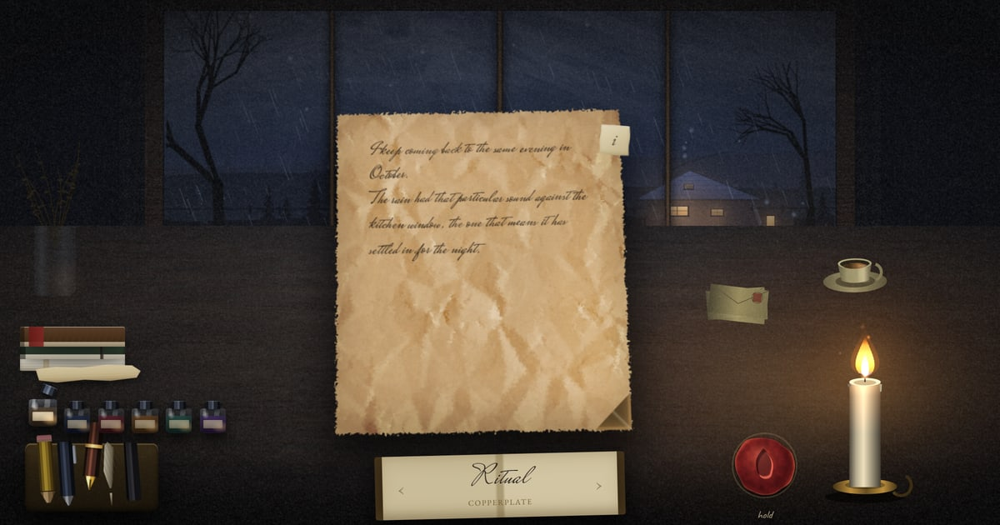

# Ritual

**Write it down. Let it go.**



Ritual is a quiet place to write the thing you cannot say. You sit at a
candlelit desk beside a rainy window, pick up a pen, and write. As you write,
the weather outside answers the way you are writing: the rain thickens, the
wind rises, and thunder closes in. When you are finished, you press a wax seal,
the storm breaks overhead, and the candle takes the page.

Nothing is saved and nothing is sent. There is no account, no server and no
storage. When the page burns it is gone, and you are still here.

**[Open it in your browser](https://ritual.harryjameschapman.com)** ·
**[Download it for Windows](https://github.com/HazzJC/writeitdownripitup/releases/latest/download/Ritual.exe)**

---

## Why it exists

Writing the hard thing down, and then doing something with the paper, is an
old and simple idea.

Counsellors often suggest writing a letter you never send. You write to the
person who hurt you, to someone you have lost, to someone you cannot talk to,
or to a younger version of yourself. Because nobody will ever read it, you can
say exactly what you mean, without softening it and without worrying how it
will land. The point is the writing, not the sending.

There is research behind the writing. In 1986 the psychologist James
Pennebaker asked students to spend fifteen minutes a day, four days running,
writing about the most upsetting experiences of their lives. In the months that
followed, those students visited the health centre less often than students
who had written about everyday things. Hundreds of studies have followed. The
effect does not hold for everyone, but expressive writing has become a widely
used and widely studied way of working through difficult feelings.

There is research behind the ripping up, too. In a 2024 study at Nagoya
University, people who had been deliberately insulted wrote down how they felt
about it. Those who then threw the paper away, or shredded it, saw their anger
fall back to where it had been before the insult. For those who kept the paper,
it did not fall away in the same way. Getting rid of the page seems to matter.

Ritual brings those ideas together. You write to someone, or about something,
knowing that no one will ever read it. Then, instead of screwing up the page and
dropping it in a bin, you get a ceremony: the storm gathers, breaks, and the
candle burns the page away in front of you. The letting go becomes something you
can see and hear, not just something you decide.

> Ritual is not therapy, and it is not a substitute for it. It borrows the shape
> of a few simple practices. If what you are carrying is more than a page can
> hold, please talk to someone: a friend, your GP, or a counsellor.

## What happens

1. **Light the candle.** The room is dark, and the sky outside is dry.
2. **Choose what to write with.** There are no menus. Everything is an object on
   the desk: a pen from the tray (pencil, ballpoint, fountain pen, quill or
   charcoal), an ink from the row of bottles, a sheet from the pile of paper,
   and a handwriting style from the specimen booklet.
3. **Write.** Within a few seconds of the first word, a light rain begins. As you
   find your pace the weather builds with you: wind moving the trees, rain
   running down the glass, thunder rolling closer, and lightning splitting the
   sky. Music steals in underneath. When you stop to think, the storm rolls away
   and leaves you a steady rain to sit in. Write hard and fast, and even your
   handwriting starts to shake.
4. **Hold the seal.** When you are done, press and hold the wax seal, and the sky
   gathers itself. Let go, and one enormous strike lands overhead, the room
   flashes white, and the heavy weather is cut away.
5. **Let it burn.** The page is carried to the candle and burns from the corner
   nearest the flame until there is nothing left but embers and ash.
6. **Afterwards.** The colour comes back into the room, the music settles into a
   single open chord, and a few words appear: *It's gone… and you're still
   here*, followed by something like *it feels good to let go* or *nothing leaves
   this room*. Then, if you want it, another page.

## An engine that listens

Ritual began as a design exercise. Could a piece of software respond to *how*
someone is writing, rather than *what* they write, and use light and sound to
amplify what they are feeling, and then give them a release?

**It never reads your words.** Nothing about the storm depends on what you write,
only on the way you write it: how fast you are going compared with your own
usual pace, how long you have been at it, how much you have written, when you
pause, and when you begin a new paragraph. The words never leave the page, and
the page never leaves your device.

A handful of principles came out of that.

- **It measures you against yourself.** Typing speed means nothing on its own. A
  slow, careful writer who breaks into a sudden rush gets the same storm as a
  fast typist doing the same, because the engine only cares about the change.
- **The weather has to build.** A session opens in silence under a dry sky, and
  the first minute can only unlock so much. The storm can never be louder than
  the weather that has actually gathered.
- **It rises quickly and falls slowly.** Feelings tend to arrive faster than they
  leave, and so does the storm: seconds to swell, and much longer to settle.
  Pausing to think never snaps it off.
- **The session has a shape.** Writing builds the storm. Holding the seal is the
  crescendo. Letting go is a single strike, then release, then calm. The colour
  drains slightly out of the room as the storm rises, so when the clearing comes
  it feels noticeably warmer and brighter than the room you started in.
- **Everything is one response.** A single number drives the lighting, the sky,
  the rain on the glass, the candle, the handwriting and every sound. The
  thunder, the flicker on the wax and the shake in your letters are not separate
  effects that happen to coincide. They are the same thing, reaching you through
  different senses.

---

## How it works

### One number

`IntensityEngine` watches how you write and publishes a single value between 0
and 1. The lighting engine, the sky, the glass, the candle, the dust in the air,
the objects on the desk, the handwriting and every voice in the soundscape all
read that one value. Nothing polls anything else.

### The intensity meter

Four influences are combined every frame.

**1. The personal baseline, a flow detector.** Two speeds are tracked at once: an
*instant* rate over the last five seconds, and your *session average* over the
time you have actually spent writing. Long pauses are left out, so staring out of
the window does not drag the average down. Absolute speed is irrelevant, and 30
words a minute is treated exactly like 90. What counts is breaking into a sprint
*relative to yourself*, which adds up to **+60%** on top of the floor. Until the
engine has watched you for a while it does not know your pace, so it blends from
a typical writer's speed towards your measured one over the first 30 seconds.
Without that, an ordinary opening sentence would read as a colossal sprint,
simply because the running average starts near zero.

**2. The floor: time and volume.** As the entry grows in both minutes and
characters, the *minimum* level of the storm rises. Time counts up to **3
minutes** and volume up to **1,500 characters** (about 250 to 300 words), lifting
the floor from **5% to 40%**. A long session never returns to a completely quiet
sky, however long you pause.

**3. The cold-start clamp.** For the first **20 seconds**, a burst of typing can
only unlock part of the storm: none of it at the very start, half at 10 seconds,
and all of it at 20. Hammering out your first sentence cannot summon a hurricane.

**4. Asymmetric gliding.** The storm swells quickly and decays slowly: roughly
**2 to 3 seconds** of sustained fast writing to reach full intensity, and **6 to 8
seconds** to settle back to the floor when you stop.

These numbers live in `INTENSITY_CONFIG` at the top of
[src/intensity.js](src/intensity.js). The engine is pure, with no page and no
audio in it, so its behaviour can be simulated offline.

### Presence: how long it has been raining

Intensity answers *how hard are you writing right now*. That is deliberately not
the same question as *how long has it been raining*, so there is a second, much
slower value called **presence**. It starts at zero and takes a couple of minutes
of writing to reach one.

A session opens with a dry sky and stays dry until you write. Within a few
seconds of the first word a light rain starts: a thin fall outside the window,
drops beginning to gather on the pane, and the odd tap on the glass. From there
the weather thickens on its own slow clock, over minutes rather than seconds.
Both the sound of the rain and the rain you can see are held back by presence.

The music waits for the writing too. Nothing plays when the candle is lit. About
five seconds after you start, the score begins to steal in beneath the rain, over
eight seconds, so that it arrives as an answer to starting rather than as a
soundtrack that was already playing when you sat down.

### Punctuating moments

| Moment | What happens |
| --- | --- |
| **Second paragraph** | A distant roll of thunder, guaranteed, with a faint bolt low in the far cloud. |
| **Third paragraph** | A lightning strike, guaranteed: a clear bolt, and closer. |
| **Later paragraphs** | Rolled against the current intensity. A quiet sky answers rarely and from far off; a raging one answers almost always, and close. Every strike shows its bolt. |
| **Holding the seal** | The crescendo: a swell of about +0.20 above wherever you already are, over 2.4 seconds and under a ceiling, so it is clearly felt without being a jump cut. One distant rumble as the sky gathers, and otherwise nothing. |
| **Letting go** | One enormous strike directly overhead. The flash holds the room white and takes seconds to fade, with deep thunder right behind it. Then the release: the heavy weather is cut away and the page goes to the candle. |
| **After the burn** | Tranquillity. The score resolves to one open, sustained chord, the colour returns to the room, and the closing lines arrive one at a time over about eight seconds. |

Turn on the meter in the info sheet to watch all of this live on a brass
barometer, with the floor, the surge, the cold-start clamp and both rates broken
out.

### The soundscape

Everything you hear is synthesised live, in the browser, with the Web Audio API.
**There are no audio files in this repository.**

The governing idea for the weather is that **you are indoors**. You are not
standing in the rain; you are hearing it through a pane of glass and a roof.
Broadband hiss is what rain sounds like when it is falling on you, and it swamps
everything else, so there is none of it.

- **Rain.** A dark, quiet bed of rain on the roof and garden, heard through a
  wall; a less muffled layer that only arrives in heavy rain; and the part that
  carries the character, the resonant *taps* of individual drops striking the
  pane, spread across the stereo field because the window is wide. Light rain is
  a few countable ticks. At the top of the storm they reach seventy a second and
  run together into a patter, and one more layer arrives: water sheeting down the
  glass, kept in the mid range and always moving, so that it trickles rather than
  hisses.
- **Wind.** Brown noise through a resonant band, with gusts built from
  oscillators running at unrelated rates, so the pattern never audibly repeats.
- **Thunder.** What makes synthesised thunder sound fake is a sharp transient,
  which reads as a click or a door slamming. Thunder heard from inside has almost
  no attack: it arrives, swells and rolls as the sound comes back off everything
  between you and the strike. So the rumble's attack is slow even overhead, its
  filter stays under 500Hz, a second delayed rumble comes back off the hills, and
  most of the signal goes to a long, dark reverb. Distance changes the filter, the
  length, the tail and the delay before you hear it.

  A strike close enough to matter also has a **crack**, the air tearing just
  before the rumble, which is what makes it read as lightning rather than as
  weather. It is shaped to stay well away from a click: a 7ms onset rather than an
  instant one, nothing above about 2.4kHz, and a crackle built from ramps between
  points 5ms apart, so the waveform swells unevenly but never steps. Rendered
  offline through the full audio chain, its sharpest step is less than half the
  level of the sound around it, where a click would be several times that.
- **The score.** Generative, in D aeolian, over an unresolved i–VI–III–iv
  progression. Layers gather as the storm builds: a drone, then slow detuned
  pads, then struck bell tones, a high glassy shimmer, and a low pulse near the
  peak. Note density and register follow the intensity, so the music quickens
  when you do and thins out when you stop.
- **The pen on the paper.** One continuous voice rather than a sound per
  keypress, because a sound per keypress is what a keyboard sounds like, not a
  pen. It is held open while characters keep arriving and released after a real
  pause, so a phrase is one unbroken stroke and stopping to think is heard as the
  nib lifting. Each instrument shapes it: a pencil rasps, a ballpoint barely
  whispers, a fountain pen lays down something wet and round, and a quill
  scratches.

A master low-pass filter works as a **distance** control. Calm weather is heard
through a closed window, and as the storm builds the filter opens until the
weather is effectively in the room. Three things bypass it: the pen, the fire and
the drops on the pane. All three are right there in the room with you, and
muffling them when the sky is calmest would be exactly backwards.

### The view outside

The landscape is four layers of depth rather than one silhouette, and each is
recoloured relative to the sky at the horizon. At night, distance is carried
almost entirely by contrast. The far ridge sits a shade lighter than the sky
behind it, because haze scatters light towards you, and each nearer layer is
darker and sharper. A single black cutout reads as scenery on a stage. Splitting
it up is also what lets a strike light the edges of the near trees while the far
ones only glow.

The cottage across the field is drawn lit, rather than cut out of a silhouette. A
hole in a silhouette gives you a bright rectangle floating in the dark; a wall
you can see, with light spilling down it from its own windows and a slate roof
catching the sky, is what makes the windows read as windows. They are
deliberately different sizes at different heights, because two matching lit
rectangles side by side look unmistakably like a pair of eyes.

The trees bend with the storm, pivoting about their roots, and the rain on the
glass gathers into drops that grow, merge and run.

Three textures are generated when the app starts, in
[src/scene/textures.js](src/scene/textures.js): cotton lace for the curtains,
soft grime for the glass, and film grain over everything. The grain is dark noise
blended with `screen` rather than grey noise with `overlay`, which on a scene
this dark does almost nothing. Screen bites in the shadows and fades out in the
highlights, which is how real film grain behaves. It changes thirty times a
second, a rate that divides both 60Hz and 120Hz exactly, so every frame of grain
is held for the same number of display frames.

### The page

The writing surface is a controlled `contenteditable`: a string of text is the
single source of truth, and the page is rebuilt from it. That is what makes
handwriting at the level of individual letters possible. Every letter is its own
element, with its own rotation, offset, scale and ink density.

Two details do most of the work.

- **Stable wobble.** Each letter's wobble comes from a hash of its position and
  the session, so it is repeatable. Re-draw the same text and the same letters
  wobble the same way, so nothing shimmers as you type.
- **Shared drift.** Neighbouring letters follow the same slow noise, so words
  ride up and down together. Independent noise for every letter looks like a
  ransom note; shared noise looks like a hand.

On top of that, the ink wanders as the nib runs wet and dry, pools where a
stroke begins after a lift and, with the quill, runs out entirely and has to be
recharged. The handwriting also deteriorates as the storm rises: the wobble grows
with the intensity, so writing fast in a tempest looks like it.

### Choosing things

There are no menus. Every control is the object it controls.

| Object | What it is |
| --- | --- |
| **The tray** | Five instruments. Click one and it lifts out. |
| **The bottles** | Six inks. The chosen bottle stands open and clinks as it is set down, pitched along the row so that each one sounds different. Graphite and charcoal bring their own colour, so the bottles dim. |
| **The pile of paper** | Four paper stocks, each shown as the thing that paper comes out of: a bundle of loose sheets, a block of writing paper, a bound notebook and a ledger. |
| **The specimen booklet** | Twelve handwriting styles. Flip through its pages. |
| **The wax seal** | Press and hold to finish. |
| **The tab on the page corner** | About Ritual, the settings, and a plain text box. |

Underneath, they are real buttons, grouped as radio sets with arrow-key
navigation and proper labels. Making things look like real objects should never
cost you the keyboard.

### Keeping it smooth

A scene with this many layers is easy to make slow. On a laptop with Intel Iris
Xe graphics at 175% scaling, an earlier version ran at around seventeen frames a
second while you wrote. The fixes kept everything you can see:

- **Light reaches the styles sparingly.** Changing a CSS variable at the top of a
  page makes the browser restyle the whole document, and repaint everything that
  uses any variable at all. The candle's fast flicker now lives in the canvases
  and in the opacity of a single overlay, while the page, the desk and the objects
  get a smoothed candle that is only written when it moves by a visible step.
- **Soft things are drawn at soft resolutions.** The sky and clouds are painted at
  half resolution and scaled up, and each layer of landscape is drawn only where
  it actually contains something. Compared pixel by pixel with the original, the
  difference averages less than one level in 255.
- **Many small drawings become a few large ones.** The rain outside is drawn in
  six bands of depth instead of one stroke per drop, and the wax seal is relit
  thirty times a second rather than on every frame.

On the same laptop, writing now runs at about twenty-eight frames a second, and
heavy rain at about twenty-one, up from fourteen.

## Accessibility and comfort

- **A plain text box.** Behind the tab on the page corner, and kept in sync with
  the page. If the handwriting is hard to read, or you would simply rather type,
  write there instead.
- **Calm the storm.** Stops the screen shake and the vibration, and is switched on
  automatically if your system asks for reduced motion. The weather still runs.
- **Volume**, and a mute that fades rather than cuts.
- Every object can be focused, is labelled, and can be reached with the arrow
  keys.
- The focus ring is hidden on the writing surface only. A ring around the whole
  sheet breaks the scene, and the text cursor already shows where you are. Every
  other control keeps it.
- Sound only starts when you light the candle, as browsers require.

---

## Get it

**In your browser:** <https://ritual.harryjameschapman.com>. There is nothing to
install. It works offline after your first visit, and Edge and Chrome will offer
to install it as an app with its own window and icon.

**On Windows:** [download Ritual.exe](https://github.com/HazzJC/writeitdownripitup/releases/latest/download/Ritual.exe).
It is a single 4.7 MB file. Save it anywhere, double-click it, and write. There
is no installer and nothing to set up.

The first time you run it, Windows shows a blue box saying **"Windows protected
your PC"**. This is not a virus warning. Windows shows it for every program that
has not paid for a code-signing certificate, and this one has not. Click **More
info**, then **Run anyway**. Windows only asks once.

If you would rather have Ritual in your Start menu, there is also an installer on
the [releases page](https://github.com/HazzJC/writeitdownripitup/releases/latest).
The app is the same either way.

## For developers

Nothing below is needed to use Ritual.

```bash
npm start              # dev server on http://localhost:5173
npm run build:single   # dist/ritual.html, the whole app in one file
npm run build:desktop  # a Windows .exe and installer
```

The app is plain HTML, CSS and JavaScript modules, with no framework and no
dependencies at runtime. The dev server exists only because JavaScript modules
cannot be loaded straight from a file on disk.

### Three ways to run it

| | Size | Needs |
| --- | --- | --- |
| **The website** | 2.1 MB | Nothing. Installable from Edge or Chrome, and works offline once visited. |
| **`dist/ritual.html`** | 3.1 MB | Nothing at all. It is one file; double-click it. It works on any computer, including a Mac. |
| **`Ritual.exe`** | 4.7 MB | Windows with WebView2, which comes with Windows 11. |

The single file carries everything inside itself, so opening it makes exactly one
request: for the file itself. It is the only version that needs a bundler,
because browsers will not load modules from a file on disk, so esbuild flattens
them into one script. esbuild is only used while building; the website and the
desktop app ship the original source untouched.

The desktop app is the same web app in a WebView2 window, which is Chromium, so it
looks exactly like the website. Rust's only job is to open the window: no
commands are registered and no permissions are granted, because the app asks the
operating system for nothing. Building it needs Rust, the MSVC build tools and
WebView2. The finished program is published on GitHub's releases page, and
deliberately not committed to the repository, because git would keep every 4.7
MB copy forever.

### Deployment

The website is the repository. Cloudflare publishes the root of the repository as
a static site on every push to `main`, without a build step of its own, so there
is very little that can break between a push and a working site. Every path is
relative, and once loaded the app makes no network requests at all.

[`.assetsignore`](.assetsignore) decides what is uploaded, and the answer is only
the site: `index.html`, the icons and manifest, the service worker, `_headers`,
`src/`, `styles/` and `assets/`. Everything else stays out, including
`node_modules`, the desktop build and any `.exe`. Without it, the build's own
dependencies were uploaded too, and Cloudflare's 25 MiB limit on a single file
rejected every deploy.

Two files are generated and committed, and need regenerating when the app's files
change:

```bash
npm run build:sw       # sw.js: the list of files for offline use, and its version
npm run build:icons    # favicon.svg to every icon size, plus the Windows .ico
```

`sw.js` ties its cache to a hash of every file's contents, so a changed file means
a new cache, and the old one is thrown away. Forgetting to regenerate it is not
fatal: `index.html` is always fetched from the network first, precisely so that a
stale cache can put itself right.

### Debugging

- **Ctrl+Alt+D** opens the debug overlay, as does adding `?debug` to the address.
  It graphs intensity and presence, prints every number the scene is reading, and
  gives you a slider for each of the two values that drive the world. You can pin
  the storm at nothing or at its peak, or sweep between them and watch every part
  of the scene respond, instead of writing for three minutes to find out. It also
  fires thunder and lightning on demand, and switches the pen, ink, paper and
  handwriting. Nothing is built until you open it. The obvious shortcut,
  Ctrl+Shift+D, bookmarks every open tab in Chrome and Edge, and a page cannot
  stop that.
- `window.ritual` is available in the browser console. `ritual.debugIntensity =
  0.8` pins the storm at a chosen level and `ritual.debugIntensity = null` hands
  control back. `ritual.debugPresence` does the same for the slower value.

### Project layout

```
index.html            the scene, and the SVG filters that tear the page's edges
server.mjs            a static file server for development

src/
  intensity.js        the meter: pure, with no page and no audio in it
  storm-events.js     when thunder and lightning are allowed to happen
  main.js             start-up, the frame loop, and the arc of the ritual

  core/               maths and seeded noise
  audio/
    core.js           the audio context, master chain, reverb and noise
    weather.js        rain, wind and thunder
    music.js          the generative score
    writing.js        the pen on the paper, and the fire
  scene/
    textures.js       lace, film grain and grime, generated at start-up
    lighting.js       candle, lightning and ambient light, written to CSS sparingly
    sky.js            the view through the window, in four layers of depth
    glass.js          rain gathering on, and running down, the pane
    candle.js         soft-body flame physics
    props.js          the objects on the desk, shaded by their angle to the flame
    atmos.js          dust, embers and ash
    burn.js           the page burning
  write/
    hands.js          handwriting styles, instruments, inks and paper
    paper.js          the writing surface
  ui/                 the desk objects, the seal, the panels, vibration, debugging

styles/               base, scene, paper and interface styles, and the fonts
assets/               textures and fonts; see assets/CREDITS.md

tools/
  build-sw.mjs        generates sw.js
  build-icons.mjs     favicon.svg to every icon size
  build-single.mjs    the one-file build
  build-dist.mjs      the clean copy the desktop build packages

src-tauri/            the desktop shell: a window, and nothing else
_headers              caching and security headers
.assetsignore         what Cloudflare may publish, and what it may not
sw.js                 generated; do not edit by hand
```

## Credits

The wood and paper textures come from [ambientCG](https://ambientcg.com) and are
in the public domain (CC0). The handwriting and type faces come from
[Google Fonts](https://fonts.google.com), under the SIL Open Font License or the
Apache License. Every sound is synthesised in the browser, so there are no
recordings. The details are in [assets/CREDITS.md](assets/CREDITS.md).

## Further reading

- Baikie, K. A. and Wilhelm, K. (2005).
  [Emotional and physical health benefits of expressive writing](https://www.cambridge.org/core/journals/advances-in-psychiatric-treatment/article/emotional-and-physical-health-benefits-of-expressive-writing/ED2976A61F5DE56B46F07A1CE9EA9F9F).
  *Advances in Psychiatric Treatment*. A review of the research that grew out of
  Pennebaker's first studies.
- Kanaya, Y. and Kawai, N. (2024).
  [Anger is eliminated with the disposal of a paper written because of provocation](https://www.nature.com/articles/s41598-024-57916-z).
  *Scientific Reports*. The Nagoya University study on throwing the page away.
- [How unsent letters helped me find words](https://www.bps.org.uk/psychologist/how-unsent-letters-helped-me-find-words).
  *The Psychologist*, from the British Psychological Society.

---

## Appendix: technical verification

The sections above are the project as it is meant to be read. This appendix is
narrower: it is a plain record of what was actually checked in the code and the
running site, for anyone who wants evidence rather than assurance.

### Privacy claim, verified

The README says "nothing is saved and nothing is sent." That was checked three
ways against the live site and the source in this repository:

1. **No code path exists that could send the text anywhere.** A search of every
   file in `src/` for `fetch(`, `XMLHttpRequest`, `WebSocket`, `sendBeacon`,
   `localStorage`, `sessionStorage`, and `indexedDB` returns zero matches. There
   is no analytics library, no error-reporting SDK, and no code that reads the
   page's text outside the modules that render it
   ([`src/write/paper.js`](src/write/paper.js)) and burn it
   ([`src/scene/burn.js`](src/scene/burn.js)).
2. **The one network-capable file was read in full.** [`sw.js`](sw.js), the
   service worker, is the only file with `fetch` calls in the whole project.
   It precaches static assets (scripts, styles, fonts, textures) for offline
   use and serves them cache-first; it never touches the writing surface or
   posts anything. `_headers` confirms the deployed site adds no
   `Content-Security-Policy` (the handwriting engine needs `unsafe-inline`
   styles to jitter each letter), which is a deliberate trade-off, not an
   oversight — see the comment in [`_headers`](_headers).
3. **Observed at runtime.** The live site
   (<https://ritual.harryjameschapman.com>) was loaded in a browser with
   network logging on, a full sentence was typed into the page, and the
   candle was lit. Every request captured was a `GET` for a static asset
   (`index.html`, the CSS/JS modules, woff2 fonts, jpg textures) — nothing
   carrying the written text, and no `POST` of any kind, at any point in the
   session.

Taken together: the privacy claim holds. There is no account, no server-side
component that receives page content, and no client-side storage of it either
— the text lives only in the DOM (`contenteditable`) for the length of the
session and is discarded when the tab closes or the page burns.

### Architecture, briefly

No framework, no runtime dependencies. Plain ES modules loaded directly by the
browser (`src/main.js` as the entry point), a Web Audio graph synthesising
every sound live, and a canvas/DOM scene driven by the single `IntensityEngine`
value described above. `server.mjs` is a zero-dependency static file server
used only in local development, because `file://` cannot load ES modules.
`esbuild` (dev-only) flattens the modules into one file for `dist/ritual.html`
and the Tauri desktop build; the deployed website ships the untouched source.
Full detail is in "How it works" and "For developers" above.

### Installation / local setup

```bash
git clone https://github.com/HazzJC/writeitdownripitup.git
cd writeitdownripitup
npm install
npm start          # http://localhost:5173
```

`npm run build:single` produces `dist/ritual.html`, a self-contained file that
opens directly in a browser with no server. `npm run build:desktop` requires
Rust, the MSVC build tools and WebView2, and produces the Windows build; that
step was not exercised as part of this review.

### Testing

There is no automated test suite in this repository at the time of this
review: no `*.test.js`/`*.spec.js` files, no test runner in
[`package.json`](package.json), and no CI workflow (no `.github/workflows`
directory). The project's own note in `src/intensity.js` — that the intensity
engine is "pure, with no page and no audio in it, so its behaviour can be
simulated offline" — describes code that is *structured* to be testable,
but no such tests currently exist. Verification for this review was manual:
static code search plus a live run against the deployed site, as described
above.

### Product decisions worth naming

- **No save, no draft, no history, by design.** The whole premise — that you
  can write the true thing because no one, including a future version of you
  scrolling back through drafts, will ever read it — depends on there being
  nothing left afterward. Adding persistence would not be a neutral feature;
  it would undercut the one promise the app makes.
- **No CSP, deliberately.** Noted above: a strict `style-src` would silently
  flatten the handwriting jitter that makes the page look handwritten rather
  than typed, with no error and no visible failure mode except the app quietly
  looking wrong. Given there is no third-party content and all text is
  escaped before it is rendered, the team judged the CSP not worth what it
  would cost.
- **A static site with no backend at all**, rather than a server that
  promises not to log anything. The privacy claim is stronger for being
  architecturally true rather than policy-true: there is no server-side code
  path to audit because there is no server-side code.
